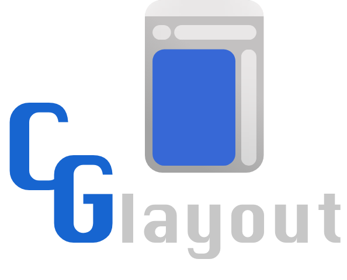
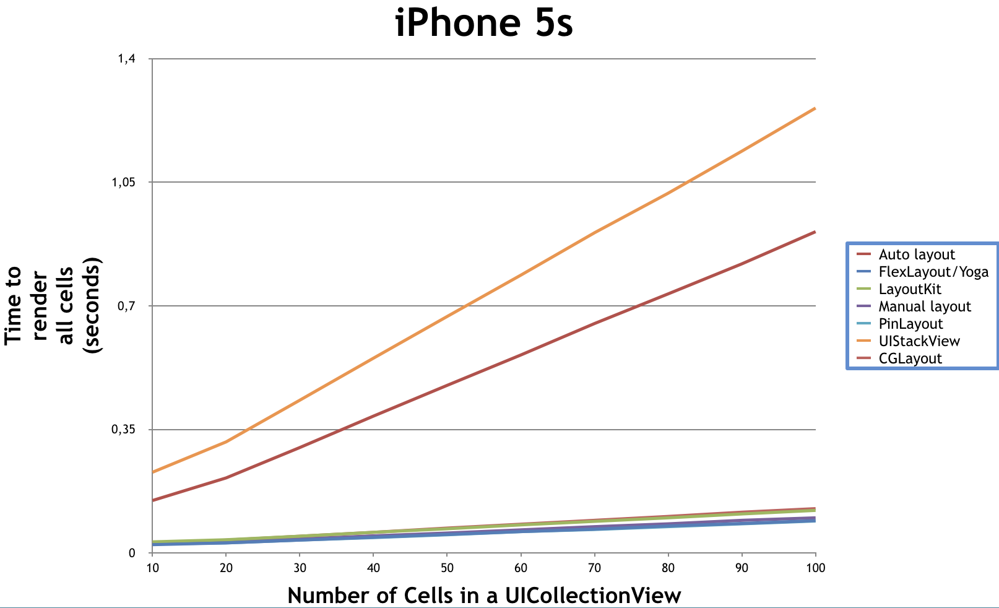
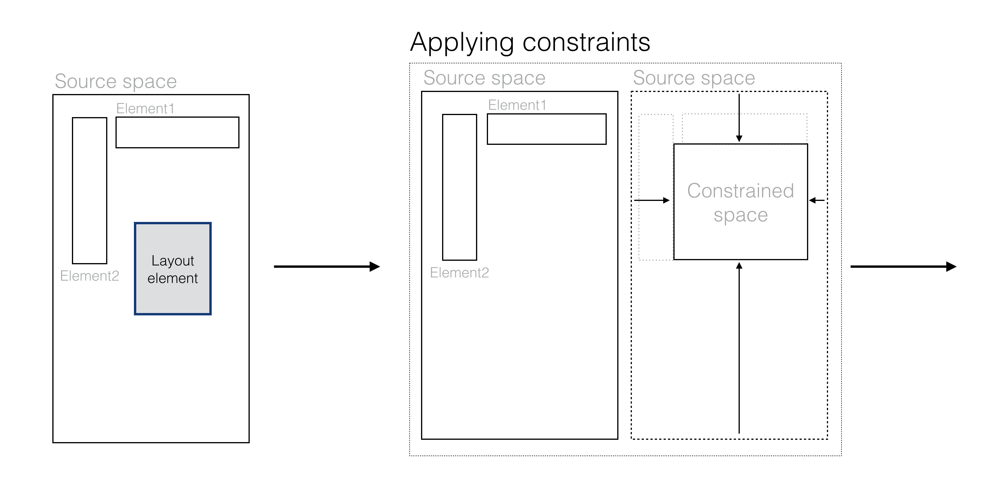
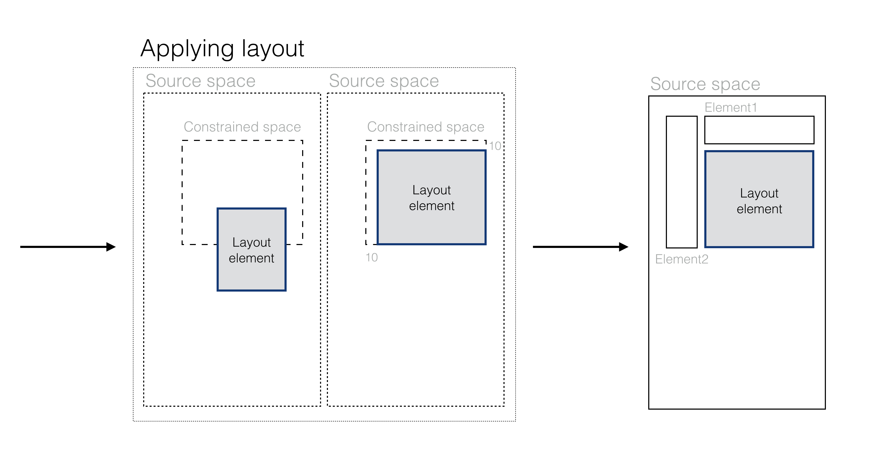

# CGLayout

[](https://travis-ci.org/k-o-d-e-n/CGLayout)
[](http://cocoapods.org/pods/CGLayout)
[](http://cocoapods.org/pods/CGLayout)
[](http://cocoapods.org/pods/CGLayout)

<p align="center">
    
</p>

Powerful autolayout framework, that can manage UIView(NSView), CALayer and not rendered views. Has cross-hierarchy coordinate space. Implementation performed on rect-based constraints. Fast, asynchronous, declarative, cacheable, extensible. Supported iOS, macOS, tvOS, Linux.

<p align="center">
    
</p>
Performed by [LayoutBenchmarkFramework](https://github.com/lucdion/LayoutFrameworkBenchmark)

## Quick tutorial

Layout with `CGLayout` built using layout-blocks. To combine blocks into single unit use `LayoutScheme` entity (or other entities that has suffix `Scheme`).
```swift
let subviewsScheme = LayoutScheme(blocks: [
// ... layout blocks
])
```
To define block for "view" element use `LayoutBlock` entity, or just use convenience getter method `func layoutBlock(with:constraints:)`.
```swift
titleLabel.layoutBlock(
    with: Layout(x: .center(), y: .top(5), width: .scaled(1), height: .fixed(120)),
    constraints: [
        logoImageView.layoutConstraint(for: [.bottom(.limit(on: .inner))])
    ]
)
```
For understanding how need to built layout block, let's see layout process in `LayoutBlock`. 
For example we have this configuration:
```swift
LayoutBlock(
    with: layoutElement, 
    layout: Layout(x: .left(10), y: .top(10), width: .boxed(10), height: .boxed(10)),
    constraints: [
        element1.layoutConstraint(for: [
            .bottom(.limit(on: .outer)), .right(.limit(on: .inner))
        ]),
        element2.layoutConstraint(for: [
            .right(.limit(on: .outer)), .bottom(.limit(on: .inner))
        ])
    ]
)
```
<p align="center">


</p>
You have to carefully approach the creation of blocks, because anchors and based on them constraints not have priority and is applying sequentially.
Constraints should operate actual frames, therefore next layout block must have constraints with "views", that will not change frame.

Layout anchors are limiters, that is oriented on frame properties (such as sides, size, position).
Any side-based anchors have three base implementations: alignment, limitation(cropping), pulling. Each this implementation have dependency on working space: inner and outer.
Size-based anchors are represented by two implementations: size, insets.
All layout anchors you can find in `enum LayoutAnchor`.

To create associated layout constraints use `protocol LayoutConstraintProtocol`.
Framework provides such default implementations:
- `LayoutConstraint`: simple associated constraint that uses `var frame` of passed element to constrain source rect. Use him to build dependency on external workspace.
- `AdjustLayoutConstraint`: associated constraint to adjust size of source space. Only elements conform to `protocol AdjustableLayoutElement`  can use it.
- `ContentLayoutConstraint`: associated constraint that uses internal bounds to constrain, defined in 'layoutBounds' property of `protocol LayoutElement`. Use it if you need to create dependency on internal workspace. For example, element inside `UIScrollView`.
- `BaselineLayoutConstraint`: associated constraint that depended on base line. Only elements conform to `protocol TextPresentedElement` can use it.
- `AnonymConstraint`: constraint to restrict source space independently from external environment.
- `MutableLayoutConstraint`: Layout constraint that creates possibility to change active state
You can find all this constraints through convenience functions in related elements. Use him to build layout blocks.

In common case, adjust constraints should be apply after any other constraints (but not always).
```swift
weatherLabel.layoutBlock(
    with: Layout(x: .left(10), y: .top(), width: .scaled(1), height: .scaled(1)),
    constraints: [
        weatherImageView.layoutConstraint(for: [topLimit, rightLimit, heightEqual]),
        weatherLabel.adjustLayoutConstraint(for: [.width()])
    ]
)
```

```swift
AnonymConstraint(anchors: [
    Inset(UIEdgeInsets(top: 0, left: 10, bottom: 0, right: 15))
])
```

Each layout-block has methods for layout, take snapshot and applying snapshot.
Consequently you may use layout-blocks for direct layout, background layout and cached layout:
```swift
// layout directly
layoutScheme.layout()

// layout in background
let bounds = view.bounds
    DispatchQueue.global(qos: .background).async {
    let snapshot = self.layoutScheme.snapshot(for: bounds)
    DispatchQueue.main.sync {
        self.layoutScheme.apply(snapshot: snapshot)
    }
}

// cached layout
if UIDevice.current.orientation.isPortrait, let snapshot = portraitSnapshot {
    layoutScheme.apply(snapshot: snapshot)
} else if UIDevice.current.orientation.isLandscape, let snapshot = landscapeSnapshot {
    layoutScheme.apply(snapshot: snapshot)
} else {
    layoutScheme.layout()
}
```

For implementing custom layout entities and save strong typed code, use `static func build(_ base: Conformed) -> Self` method.

Framework provides `LayoutGuide` as analogue UILayoutGuide. It has possible to generate views and add them to hierarchy.
To create layout element placeholders use `LayoutPlaceholder` class or him element specific subclasses (`LayerPlaceholder`, `ViewPlaceholder`).
Also you can use placeholder based on `UILayoutGuide`: `UIViewPlaceholder`, to apply in Autolayout environment.

All examples of code you can see in `Example` folder.

For more details, see documentation and example project.

## Contributing

I will be happy your feedback, advices and pull requests. For more information read [here](https://github.com/k-o-d-e-n/CGLayout/blob/master/CONTRIBUTING.md) 

## Code documentation

See [here](https://k-o-d-e-n.github.io/CGLayout/)

## Example

To run the example project, clone the repo, and run `pod install` from the Example directory first.

## Requirements

Xcode 8.3+

## Installation

CGLayout is available through [CocoaPods](http://cocoapods.org). To install
it, simply add the following line to your Podfile:

```ruby
pod "CGLayout"
```

## Author

k-o-d-e-n, koden.u8800@gmail.com

## License

CGLayout is available under the MIT license. See the LICENSE file for more info.
